# Project proposal

**Table of Contents**

- [Introduction](#Introduction)  
- [Download Adobe XD prototype](#DownloadAdobeXDprototype)  
- [Demo application](#Demo) 
- [Wireframe](#Wireframe) 
- [ERD scheme](#Erd)
- [User properties](#Properties)
  - [Admin](#Properties)
  - [Student](#Student)
  - [Recruiter](#Recruiter)
- [WPF Application](#Wpf)
- [Walkthrough](#Walkthrough) 
  - [Intro](#Intro) 
  - [Login](#Login) 
  - [Choose profile type](#ProfileType) 
  - [Student version](#StudentVersion) 
    - [Create student](#CreateStudent) 
    - [Home page](#StudentHome) 
    - [Settings](#SettingsStudent)
    - [Matches](#SettingsStudent)
      - [Vacancy details](#StudentDetails)
    - [Chat](#StudentChat)
  - [Recruiter version](#RecruiterVersion) 
    - [Create recruiter](#CreateRecruiter) 
    - [Home page](#RecruiterHome)  
    - [Settings](#SettingsRecruiter)
    - [Matches](#RecruiterMatches)
      - [Resume details](#RecruiterDetails)
    - [Chat](#RecruiterChat)

# Introduction <a name="Introduction">
IT-Internship is an application in which a student in IT can find an internship but also virsa versa. You can compare the concept with Tinder. As a student you can swipe on internship vacancies based on the skills you gave when setting up your profile. As a recruiter you can swipe on the student profiles who has matching skills based on your selected vacancy.
After matching they have the possibililty to chat with each other and for example exchange contact information

# Download Adobe XD prototype <a name="DownloadAdobeXDprototype">
https://www.dropbox.com/t/nmxeyFA3XUvDCD7K

# Demo application <a name="Demo">
https://xd.adobe.com/view/cdb34ec1-798f-471b-9b2b-e10e4f4bd394-98e0/screen/ad4a7958-3a0a-424d-aa50-a18d9dd283ae?fullscreen 
  
# Wireframe <a name="Wireframe"> 
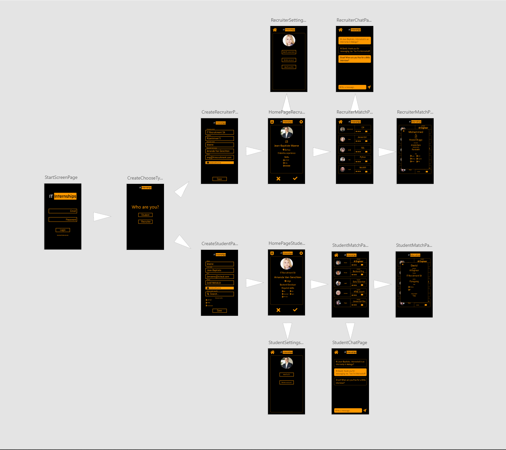

# ERD scheme <a name="Erd"> 
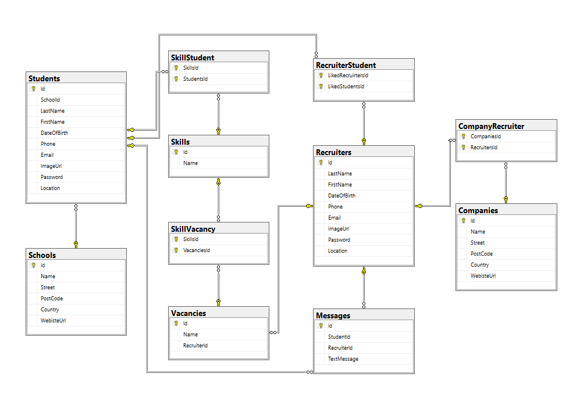

# User properties <a name="Properties"> 
## Admin <a name="Admin"> 
- Has the same properties as Student and Recruiter
- Can't login on Mobile or Website
- Create skills
- Can login on WPF
## Student <a name="Student"> 
- Login on Mobile and Website, not WPF
- Create student account
- Modify student account
- Delete student account
- Read vacancies
- Create messages
## Recruiter <a name="Recruiter"> 
- Login on Mobile and Website, not WPF
- Create recruiter account
- Modify recruiter account
- Delete recruiter account
- Create vacancies
- Modify vacancies
- Delete vacancies
- Read student account
- Create messages

# WPF Apllication <a name="Wpf">

The Wpf application is an admin tool where data can be read, created, modified and deleted in a fast way. As mentioned, this app is only accessible to admin users.

The WPF is connected to the API where the necessary endpoints are called up. The endpoints will be based on the [user properties](#Properties)

# Walkthrough <a name="Walkthrough">
## Intro <a name="Intro"> 
In this part I will do a walkthrough. 
For each page I will tell you more about the use and which functionalities are provided. 
  
## Login <a name="Login"> 
This is the login screen/start screen when you start the application. If you have an account you can log in. Your login determines whether you are a recruiter or a student.
If you don't have a profile yet, you can create one via the "No account? Make one now!" button.

In this walkthrough we will always create a new account for both recruiter and student.
We press the button "No account? Make one now!"
  
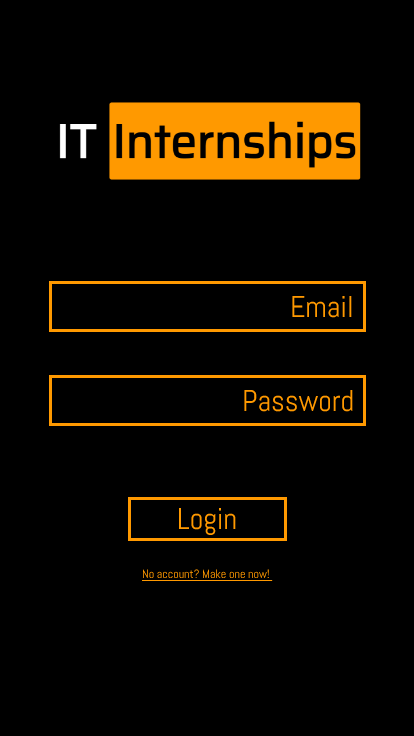  
  
## Choose profile type<a name="ProfileType"> 
On this page you determine which type of profile you want to create.

Choose [Student](#StudentVersion) button to create a student profile.    
Choose [Recruiter](#RecruiterVersion) button to create a recruiter profile.
  
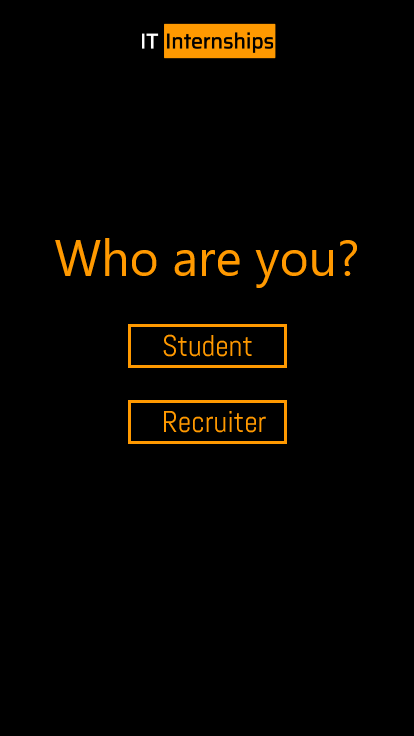
  
## Student version <a name="StudentVersion"> 
  
  ### Create student profile <a name="CreateStudent">
  This page asks for the student's personal information.  
  When the student presses the save button, a profile is created.
  
  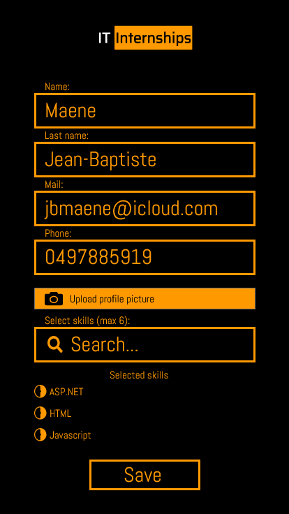
  
  ### Home page <a name="StudentHome">
  On this page, the student will be able to swipe through recruiters. The recruiters are chosen on the basis of the given skills in the resume.
  When a student and a recruiter like each other, there is a match.
  
  To view the match press the [person](#StudentVersion) in the top left corner.  
  To see the settings press the [wheel](#SettingsStudent) in the top right corner.
  
  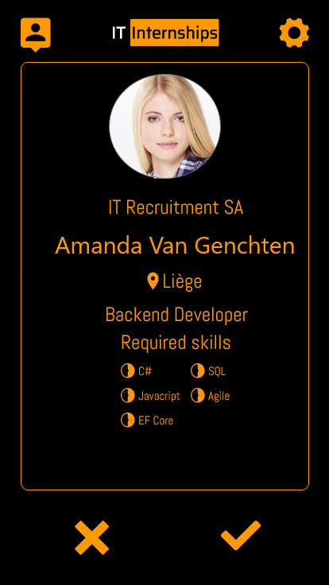
  
  ### Settings <a name="SettingsStudent">
  On this page there is a button to edit your resume and a button to delete your profile.
  
  Click on the [house](#StudentHome) in the top left corner to go back to Home.
  
  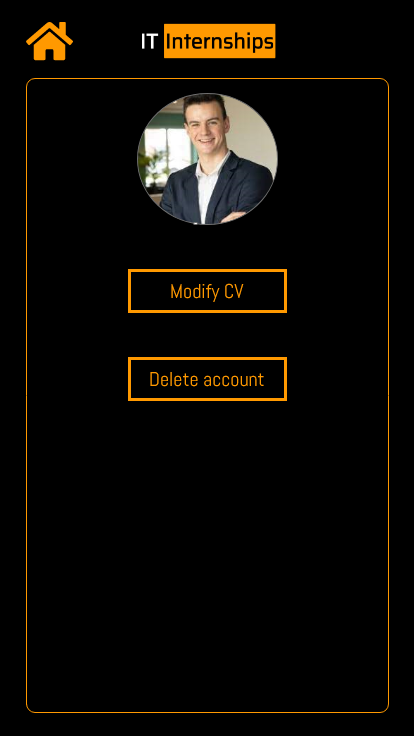
  
  ### Match Page <a name="StudentMatches">
  Here you will see a list of all matches.
  If you click on the [dots](#StudentDetails) you will find out more about the vacancy.
  Clicking on the [speech bubble](#StudentChat) will take you to the chat page.
  Click on the [house](#StudentHome) in the top left corner to go back to Home.
  
  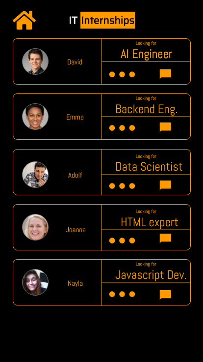
  
  #### Vancancy details <a name="StudentDetails">
  On the modal you can see more information about the vacancy.  
  Click on the [cross](#StudentMatches) to close the window.

  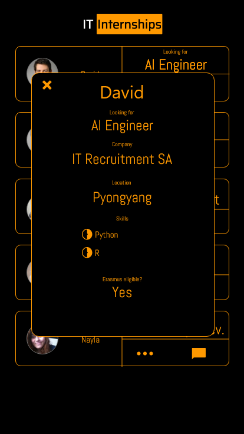
  
  ### Chat <a name="StudentChat">
  Here the student and recruiter can chat with each other.
  Click on the [house](#StudentHome) in the top left corner to go back to Home.
  
  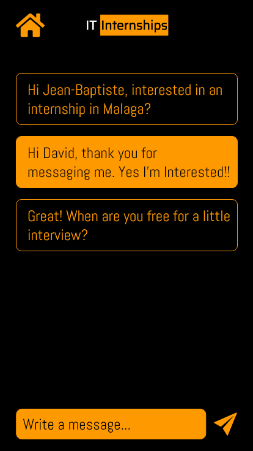
  
## Recruiter version <a name="RecruiterVersion"> 
  
  ### Create recruiter profile <a name="CreateRecruiter">
  This page asks for the recruiters's personal information and information about the company.  
  When the recruiter presses the save button, a profile is created.
  
  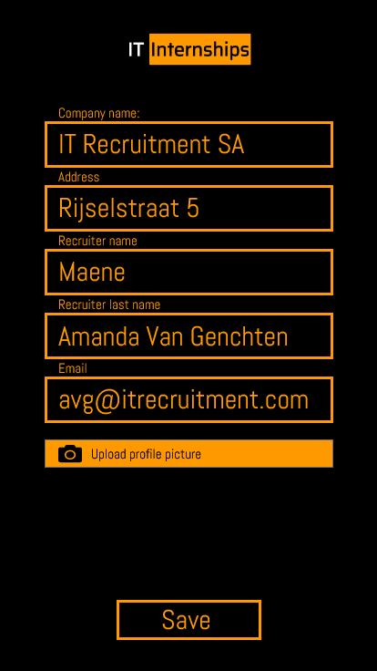
  
  ### Home page <a name="RecruiterHome">
  On this page, the recruiter will be able to swipe through students. The students are chosen on the basis of the given skills in the chosen vacancy.
  When a student and a recruiter like each other, there is a match.

  To view the match press the [person](#StudentVersion) in the top left corner.  
  To see the settings press the [wheel](#SettingsRecruiter) in the top right corner.
  
  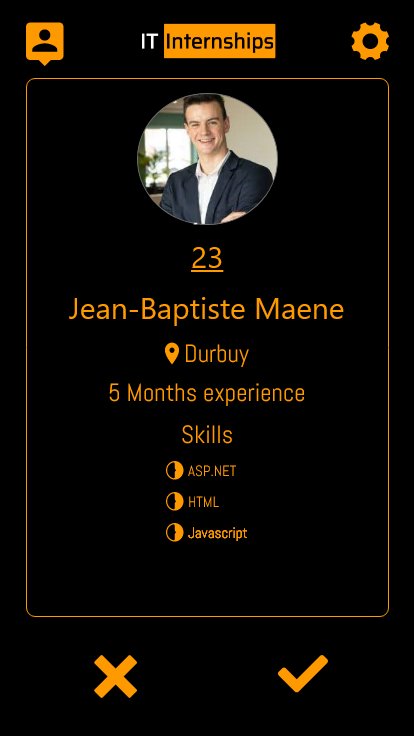
  
  ### Settings <a name="SettingsRecruiter">
  On this page there is a button to edit your vacancies, a button to edit your profile and a button to delete your profile.
  
  Click on the [house](#RecruiterHome) in the top left corner to go back to Home.
  
  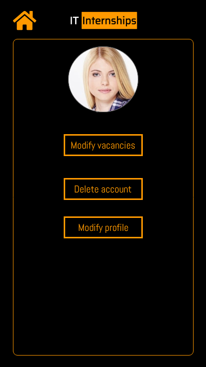
  
  ### Match Page <a name="RecruiterMatches">
  Here you will see a list of all matches.
  If you press the [dots](#RecruiterDetails) you will see more information about the student.
  Clicking on the [speech bubble](#RecruiterChat) will take you to the chat page.
  Click on the [house](#RecruiterHome) in the top left corner to go back to Home.
  
  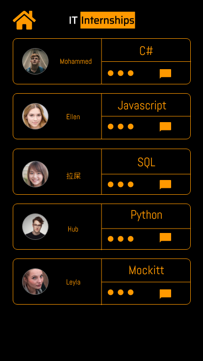
  
  #### Resume details <a name="RecruiterDetails">
  On the modal you can see more information about the student.  
  Click on the [cross](#RecruiterMatches) to close the window.
  
  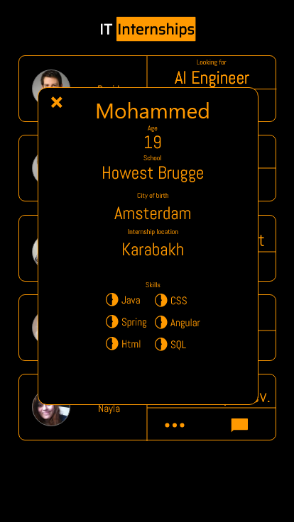
  
  ### Chat <a name="RecruiterChat">
  Here the student and recruiter can chat with each other.
  Click on the [house](#RecruiterHome) in the top left corner to go back to Home.
  
  
